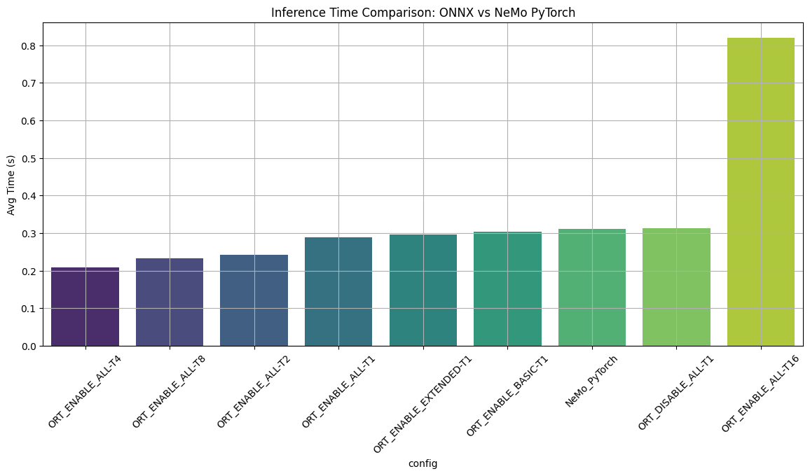

# 🇮🇳 Hindi Automatic Speech Recognition (ASR) using NeMo + ONNX + FastAPI

This project is an end-to-end **Hindi ASR pipeline** leveraging NVIDIA's [`NeMo`](https://developer.nvidia.com/nemo) models, optimized via **ONNX**, and deployed using **FastAPI**. It provides high-performance speech-to-text transcription with support for CPU inference and Dockerized deployment.

---

## 📌 Overview

We use the pretrained **`stt_hi_conformer_ctc_medium.nemo`** model from NVIDIA NeMo (v1.6.0), optimized through several ONNX configurations. The best-performing model is automatically selected and deployed via a FastAPI application. The project supports:

- Inference optimization using ONNX Runtime
- FastAPI-based deployment with Swagger docs
- Docker containerization for reproducibility
- Cross-platform compatibility (Linux, macOS, Windows)


---

## 🔽 Step 1: Download the Pretrained NeMo Model

We use NVIDIA’s **`stt_hi_conformer_ctc_medium.nemo`**, a Hindi ASR model trained with Conformer architecture using CTC loss.

### 🐧 Linux/macOS:
```bash
bash download_model.sh
````

### 🪟 Windows (via Python):

```bash
python download_model.py
```

This will download and place the model in the `model/` directory:

```
model/stt_hi_conformer_ctc_medium.nemo
```

> 🛑 Make sure the model file is named exactly `stt_hi_conformer_ctc_medium.nemo`.

---

## 🧪 Step 2: Setup Virtual Environment

Use a Python 3.11+ environment (recommended: `venv` or `conda`).

```bash
# Create virtual environment
python -m venv name

# Activate environment
# macOS/Linux
source name/bin/activate

# Windows
mvaakai\Scripts\activate

# Install dependencies
pip install --upgrade pip
pip install -r requirements.txt
```

---

## ⚙️ Step 3: Run ONNX Optimizer (Jupyter Notebook)

Launch and execute the notebook to:

* Export the NeMo model to ONNX
* Optimize it with various `onnxruntime` configurations
* Benchmark inference time
* Automatically save the best-performing model as:

```bash
model/best_optimized_onnx_model.onnx
```

```bash
jupyter notebook onnx_optimizer.ipynb
```

📊 Optimization results will be plotted:

<p align="center">
  
</p>

---

## 🚀 Step 4: Run the FastAPI Inference App

Once the ONNX model is optimized and saved, launch the FastAPI server:

```bash
uvicorn app:app --host 0.0.0.0 --port 8000
```

#### 🔍 API Docs

Open [http://localhost:8000/docs](http://localhost:8000/docs) for Swagger UI:

<p align="center">
  
</p>

#### 📬 Sample CURL request:

```bash
curl -X POST http://localhost:8000/transcribe \
  -F "file=@example.wav"
```

#### 📮 Sample Postman test:

<p align="center">
  
</p>

---

## 🐳 Step 5: Docker Instructions

### 🏗️ Build the image

```bash
docker build -t hindi-asr-app .
```

### ▶️ Run the container

```bash
docker run -p 8000:8000 hindi-asr-app
```

> Ensure `model/best_optimized_onnx_model.onnx` exists before building.

---

## 🧠 Design Considerations

* ✅ **Speed & Portability**: ONNX inference optimized across CPU threads, execution providers
* ✅ **Modular Utilities**: WAV validation, conversion, resampling included
* ✅ **Cross-platform**: Compatible with Linux, macOS, and Windows users
* ✅ **Clear Extensibility**: Model can be easily swapped for any language or ASR task

---

## 📎 Notes

* Only `.wav` files between **5–10 seconds** are accepted for inference
* Ensure model file is always placed in `/model/` directory
* This app can be extended for multilingual transcription, diarization, or streaming

---

## 🤝 Contributing

Feel free to fork and contribute — open issues or pull requests are welcome!

---

## 📜 License

This project uses open-source licenses. Refer to `LICENSE` for more details.


